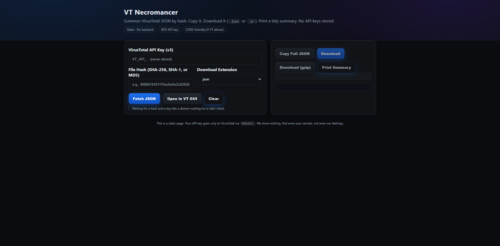
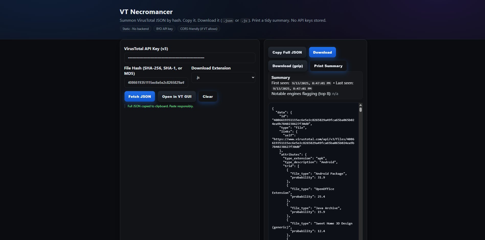

# VirusTotal JSON Downloader (aka VT Necromancer) 🧿
Static GUI to fetch VirusTotal file reports (JSON) by hash. Copy, download (.json/.js), or print summaries. GitHub Pages ready. BYO API key.

[](#-deploy)
[](#-license)
[](https://github.com/Deb-Deep-Dutta/VirusTotalJsonDownloader/stargazers)
[](https://deb-deep-dutta.github.io/VirusTotalJsonDownloader/)

> ⚡ If this repo saved you from clicking a suspicious `DefinitelyNotMalware.exe`,  
> **please ⭐ star the repo** — it keeps the demons at bay.

---

## ✨ Features
- Fetch file analysis reports from **VirusTotal API v3**  
- **GUI input** for API key + hash (SHA-256 / SHA-1 / MD5)  
- **Copy full JSON** to clipboard  
- **Download** reports as `.json` or `.js`  
- **Gzip download** (when supported) with fallback  
- **Printable summary** (meta + KPIs + flagged engines)  
- **Open in VirusTotal GUI** directly from the app  
- **Static, secure**: no backend, no secrets stored  
- Works out-of-the-box with **GitHub Pages** (with Worker proxy)

---

## 🖼️ Screenshots

**Main input view (API key + hash)**  


**Results with KPIs + JSON viewer**  


---

## 🚀 Quick Start (Localhost)

1. Clone the repo:
   ```bash
   git clone https://github.com/Deb-Deep-Dutta/VirusTotalJsonDownloader.git
   cd VirusTotalJsonDownloader

2. Open index.html in your browser (or serve via http://localhost).


3. Paste your VirusTotal API key and a file hash.


4. Click Fetch JSON.


> ⚠️ Note: When running on localhost, you can call VirusTotal API directly without Cloudflare Worker,
but some browsers may block requests due to CORS. It usually works from localhost, but not when deployed online.


See the Using without Cloudflare (localhost only) section below for the app.js code change.


---

🌐 Deploy on GitHub Pages

1. Push this repo to GitHub:
Suggested repo name: VirusTotalJsonDownloader


2. Go to Settings → Pages:

Source: Deploy from a branch

Branch: main (and /root)


3. Wait for Pages to publish.


4. Open your live URL:
👉 https://deb-deep-dutta.github.io/VirusTotalJsonDownloader/


> 🔐 Security note: API key is entered at runtime, used only in your browser.
No localStorage, no cookies, no backend.
Cloners must use their own key — your secrets remain yours.


---

🔐 Cloudflare Worker Proxy (required for GitHub Pages)

VirusTotal’s API blocks direct browser calls from GitHub Pages (CORS).
This repo works live because it uses a Cloudflare Worker proxy, locked to my domain.

If you clone or fork this repo, you must set up your own Worker and update app.js.

How to set up your Worker

1. Log in to Cloudflare Dashboard → Workers & Pages → Create Worker → Deploy → then Edit code.


2. Replace the default code with the example in docs/proxy-worker-example.js.


3. Under Settings → Variables, add:

ALLOWED_ORIGIN = https://YOURNAME.github.io
(replace YOURNAME with your GitHub username; no trailing slash).


4. Save and Deploy. Copy your Worker URL (e.g. https://something.workers.dev).


5. In app.js, set:

const PROXY_BASE = "https://something.workers.dev";
const url = `${PROXY_BASE}/files/${encodeURIComponent(id)}`;


Why this is needed

My Worker is locked to https://deb-deep-dutta.github.io.

Forks/clones will get 403 Origin not allowed.

Everyone must run their own Worker (and their own VirusTotal API key).


---

🖥️ Using without Cloudflare (localhost only)

If you only want to run this tool on localhost (not on GitHub Pages),
you can skip the Worker and talk directly to VirusTotal.

In app.js, replace the fetch URL section with:

// --- Localhost mode (direct to VirusTotal) ---
// Use this only on localhost. Will NOT work on GitHub Pages due to CORS.
const url = `https://www.virustotal.com/api/v3/files/${encodeURIComponent(id)}`;

In the distributed repo, we keep this code commented out so people know the option exists.


---

🧰 VirusTotal API Reference

Endpoint:

GET https://www.virustotal.com/api/v3/files/{id}

where {id} can be SHA-256, SHA-1, or MD5.

Header:

x-apikey: <YOUR_API_KEY>


Official VirusTotal API Docs


---

⚠️ Notes

CORS: GitHub Pages requires Cloudflare Worker proxy. Localhost may work directly.

Rate limits: Free API keys are limited. The UI shows quota info if headers are present.


---

🧭 Roadmap

[ ] Parse sandbox/behavior reports

[ ] Add search by URL or filename

[ ] Provide proxy recipe (with auth) for stricter CORS

[ ] Darker “Midnight Morgue” theme because why not


---

🤝 Contributing

PRs welcome! Keep it static (no server secrets), tidy, and preferably spooky.


---

🪙 License

MIT. Do crimes only in fiction.


---

⭐ Support

If this helped you fetch JSON without crying into curl,
star the repo ⭐ — validation is the only thing keeping this project alive.


---

🙅 Disclaimer

Not affiliated with VirusTotal. This is a third-party GUI client for their public API.
Use responsibly; don’t abuse the API or I’ll haunt your printer.

---